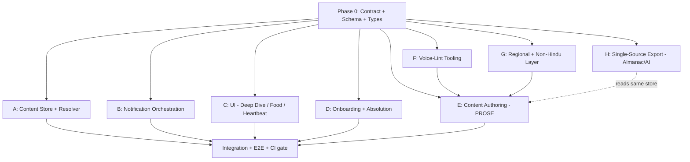

# Content Layer Plan — The Voice Layer

*Implementation plan for evolving PanchangApp from a data instrument into the Atithi Toran described in [`content-gita.md`](content-gita.md).*

> **Provenance:** This plan was converged over 5 optimization loops against the Content Gita, landing at **9/10**. The final point is execution-bound (the quality of the actual prose), not architecture-bound. This document is the architecture.

---

## 1. Why this exists

The clock is excellent and correct. The **voice does not exist yet.**

Today, the content path is pure data:

- [`festivals.json`](PanchangApp/Resources/Festivals/festivals.json) — `id`, `name`, `type`, `anchor`. No copy.
- [`FestivalOccurrence`](PanchangKit/Sources/PanchangKit/Festivals/FestivalRule.swift) — `id/name/type` only. Nothing for voice to attach to.
- [`NotificationService`](PanchangApp/Features/Notifications/NotificationService.swift) — body is `"Today is {name}. Tap to view today's panchang."`, fires once at 7am day-of.
- [`TodayView`](PanchangApp/Features/Today/TodayView.swift) — festivals render as a one-line row. No deep dive, no food, no tap-through.
- No onboarding, no absolution paragraph, no Ekadashi heartbeat.

The Gita's thesis is the **Monthly Heartbeat** — Ekadashi (24×/yr, *"the most important content in this app"*), Purnima, Amavasya, paksha transitions, named tithis — ~300 days/year of content that makes this *"a daily habit rather than a seasonal check-in."* That engine is what we are building.

## 2. The one guiding principle

> *"This document is the voice. The engine is the clock. Together they are the product."* — Content Gita

**The content layer is decoupled from the rule engine.** The engine ([`PanchangKit`](PanchangKit/Sources/PanchangKit)) stays a pure clock and never learns about prose. Content is a separate, swappable resource resolved against what the clock already computes (tithi, paksha, masa). This decoupling is also what makes parallelization possible — see §5.

---

## 3. Architecture: the seam

```
┌─────────────────┐     ┌──────────────────────┐     ┌─────────────────────┐
│  PanchangKit    │     │   Content Layer      │     │   App / UI          │
│  (the clock)    │     │   (the voice)        │     │   (the surface)     │
│                 │     │                      │     │                     │
│  PanchangDay    │────▶│  DailyContentResolver│────▶│  Heartbeat list     │
│  FestivalEngine │     │   ├ ContentStore     │     │  Deep Dive screen   │
│  (tithi/paksha/ │     │   ├ variant resolve  │     │  Food screen        │
│   masa)         │     │   └ TriggerPlan      │     │  Action affordances │
└─────────────────┘     └──────────────────────┘     │  Notifications      │
                                  ▲                    │  Onboarding         │
                                  │                    └─────────────────────┘
                        ┌─────────┴──────────┐
                        │  content/*.json     │  ◀── authored prose (Track E)
                        │  (single source of  │      also feeds almanac + AI
                        │   truth)            │
                        └─────────────────────┘
```

Everything keys off **one contract** (§4). Lock the contract first; then every track below builds against it in parallel.

---

## 4. Phase 0 — The Contract (blocking, ~1 short wave)

This is the only serialized work. Nothing else can safely start until these types and the schema are merged, because they are the shared seam. Keep it minimal and **additive only** (new files; do not modify the engine).

### 4.1 Content schema (`content/` resource, single source of truth)

One canonical store, authored once, feeding app + print almanac (Part Six) + AI corpus (Part Seven).

```jsonc
{
  "schemaVersion": "1.0",
  "entries": [
    {
      "id": "ekadashi",                 // stable key; matches a festival rule id OR a cycle id
      "kind": "cycle | festival | paksha | tithi",
      "tier": 1,                         // 1=major festival … 5=named tithi (notification priority)
      "match": {                         // how content binds to a computed day (NOT a new clock)
        "anchor": "tithi|masaTithi|paksha-transition",
        "tithi": 11, "paksha": "shukla|krishna|both",
        "masaIndex": null
      },
      "variants": [                      // most-specific wins; falls back to base entry
        { "id": "nirjala", "match": { "masaIndex": 2, "paksha": "shukla" }, "...": "overrides" }
      ],
      "voice": {
        "advance":  { "daysBefore": 7, "text": "…" },
        "eve":      { "text": "…" },
        "morning":  { "text": "…" },
        "deepDive": { "whatItIs": "…", "mythology": "…", "history": "…",
                      "regional": "…", "whatToDo": "…" },   // Part Seven 5-para structure
        "food":     { "note": "…", "recipeLink": null }     // REQUIRED — non-nullable
      },
      "triggers": [                      // notification DSL (Track B expands these)
        { "kind": "advance", "daysBefore": 7 },
        { "kind": "eve", "time": "20:00" },
        { "kind": "morning", "time": "08:00" }
      ],
      "action": null,                    // optional human-scale affordance (Track C); Rule 5
      "regions": [],                     // [] = everywhere; ["gujarati"] etc. (Part Four)
      "audioScript": null,               // V2 60-sec layer — reserved now, ships later
      "almanacBlurb": null               // Part Six short form — reserved now
    }
  ]
}
```

**Hard rules baked into the schema:**
- `food` is **non-nullable** — structurally enforces *"the food layer is not optional."*
- `deepDive` always uses the 5-paragraph Part Seven structure.
- `audioScript` / `almanacBlurb` reserved now so V2 audio and the print almanac ship without re-authoring.

### 4.2 Swift contract types (new files in `PanchangApp/Services/ContentService/`)

```swift
struct ContentEntry: Sendable, Identifiable { … }     // mirrors schema
struct VoiceLayers: Sendable { … }                    // advance/eve/morning/deepDive/food
struct DeepDive: Sendable { … }                       // 5 paragraphs
struct FoodNote: Sendable { … }                       // non-optional in ContentEntry
enum NotificationTrigger: Sendable { case advance(daysBefore:Int); case eve(time:DateComponents)
                                      case morning(time:DateComponents); case midnight
                                      case dayOffset(Int, label:String) }
struct ContentAction: Sendable { … }                  // call / addReminder / openMaps / note

protocol ContentResolving {                            // the seam other tracks mock against
    func resolve(for day: PanchangDay, region: String?) -> [ResolvedContent]
    func triggers(forUpcoming days: Int, from: Date, location: GeoLocation,
                  config: CalendarConfig) -> [ScheduledTrigger]
}
```

### 4.3 Voice-lint rule spec (markdown, drives Track F)

A checklist + machine-checkable list derived from the Gita's **Never/Always** guardrails:
flag `"It is believed that"`, parenthetical Sanskrit definitions like `"(the 11th lunar day)"`,
`"auspicious occasion"`, `"seek blessings"` (unqualified), unearned superlatives, passive
distancing (`"is worshipped"`). Output is the spec; Track F builds the checker.

**Phase 0 Definition of Done:** schema doc + Swift types + `ContentResolving` protocol stub + lint spec merged to main. ~150 lines of types, no behavior. After this, fan out.

---

## 5. Parallel tracks (run concurrently after Phase 0)

Eight tracks. The dependency graph is shallow on purpose — the contract is the only shared point, and **each track owns disjoint files** to keep merges conflict-free.



**The long pole is Track E (authoring), and it is 100% parallel to all engineering.** Start it on day one against the schema shape; it gates only the final integration, not any code track.

| Track | Scope | Starts after | Owns (no conflicts) | Mocks/Inputs |
|-------|-------|-------------|---------------------|--------------|
| **A — Content Store + Resolver** | Load `content/*.json`; variant inheritance (most-specific `match` wins, fall back to base); implement `ContentResolving`; decouple from `FestivalRule` | P0 | `Services/ContentService/ContentStore.swift`, `ContentResolver.swift` | Fixture `content.json` |
| **B — Notification Orchestration** | Expand `TriggerPlan` DSL → `UNNotificationRequest`s; daily resolver with **tier priority** (1 hero notification/slot, no spam); fix the *same-day-after-7am-drops* + single-7am limitations | P0 | `Features/Notifications/NotificationService.swift`, new `NotificationScheduler.swift`, `TriggerPlan.swift` | Stub `ContentResolving` |
| **C — UI** | `FestivalDetailView` (5-para deep dive), `FoodView`, `HeartbeatListView`; festival row → `NavigationLink`; tappable **action affordances** (call sibling, soak sabudana reminder, temple via Maps) | P0 | new `Features/DeepDive/*`, `Features/Food/*`; edits to `TodayView.swift`, `DayDetailView.swift` (row only) | Fixture `ResolvedContent` |
| **D — Onboarding + Absolution** | Onboarding flow; absolution paragraph placed **once**, gated by a seen-flag so it never repeats | P0 | new `Features/Onboarding/*`; adds one `seenOnboarding` field to `Preferences` model | — |
| **E — Content Authoring (prose)** | Write the heartbeat + majors in the voice: Ekadashi (+ named variants), Purnima/Amavasya (+ variants), paksha transitions, named tithis, the Part Two majors. **Non-code.** | P0 (schema shape only) | `content/*.json` (data only) | Gita as source |
| **F — Voice-Lint Tooling** | Build the Never/Always checker from the §4.3 spec; runs in CI to gate Track E | P0 (lint spec) | `Tools/voice-lint/*` | Lint spec |
| **G — Regional + Non-Hindu** | Gujarat-as-default wiring (Uttarayan, Bestu Varas, Kali Chaudas); Paryushana/Mahavir Jayanti/Gurpurabs as optional entries with "shared infrastructure" framing | P0 | region content in `content/` (coordinate w/ E); small toggle in `Settings` | Existing `regions` field + `gujaratiWestern` config |
| **H — Single-Source Export** | Scripts that emit the print-almanac form (Part Six) and AI few-shot corpus (Part Seven) from the same `content/` store | P0 | `Tools/export/*` | Same store as E |

### File-ownership rule
The only files touched by more than one track are `TodayView.swift`/`DayDetailView.swift` (Track C, row→link only) and `Preferences` (Track D, one additive field). Everything else is net-new in disjoint directories. **No two tracks edit the same function.** This is what makes the fan-out safe.

---

## 6. Sequencing (waves)

- **Wave 0 (serial, short):** Phase 0 contract. One person, fast.
- **Wave 1 (max parallel):** A, B, C, D, E, F, G, H all run concurrently. E and F start immediately and run longest (F gates E). Engineering tracks (A–D) finish well before E's full corpus is written — by design.
- **Wave 2 (integration):** wire A↔B↔C↔D end-to-end; turn on the voice-lint CI gate (F gates E); ship the first heartbeat slice (Ekadashi + the next real festivals) to pressure-test the voice in the running app.
- **Wave 3 (ongoing):** complete the authoring corpus; H exports flow once content stabilizes; V2 audio populates `audioScript`.

**Suggested first shippable slice for Wave 2 E2E:** Ekadashi (base + "Why Eleven" deep dive) + the next 2–3 real festivals from the current date. Smallest path that exercises resolver → trigger → notification → deep dive → food, end to end.

---

## 7. Definition of done (rubric → the Gita)

A track is done when its slice satisfies the Gita dimension it serves:

- **Voice (Five Rules)** — passes voice-lint; deep dives end at human scale; emotional beat last.
- **Five layers present** — advance/eve/morning/deepDive/food for every entry; food non-null.
- **Heartbeat** — Ekadashi/Purnima/Amavasya/paksha/named-tithi all resolve and notify.
- **Gentle notifications** — ≤1 hero notification per slot; collisions de-duped by tier.
- **Absolution** — appears once, never repeats.
- **Regional + non-Hindu** — Gujarat default; Jain/Sikh households acknowledged.
- **Single source of truth** — app, almanac, and AI corpus all derive from `content/`.

## 8. Known unknowns (the execution-bound 10th point)

These cannot be closed by architecture — only by doing the work:

1. **Prose quality** — a 10 is decided by whether ~50 entries × 5 layers actually land. The lint catches *violations*, not *greatness*.
2. **Recipe rights / links** — Track E/H need a decision on in-house recipes vs external links.
3. **Named-Ekadashi completeness** — the full 24-name list with correct masa keying needs a knowledgeable review (the Gita itself flags `festivals.json` as "provisional… requires review by a knowledgeable person").
4. **Editorial labor** — writing in this voice at heartbeat scale is the real cost; the AI pipeline (Track H/Part Seven) mitigates but does not remove the human edit pass.

---

*Plan v1.0 — derived from `content-gita.md`. The engine is the clock; this builds the voice.*
